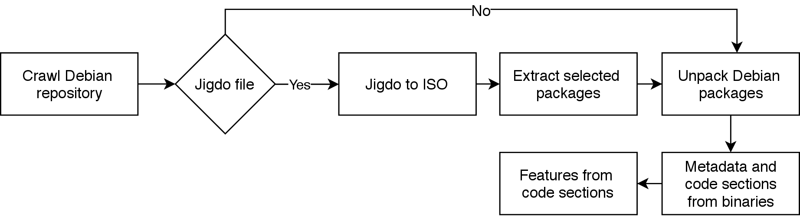

# Requirements
Found from apt:
- jigdo-lite
- fuseiso
- dpkg-deb

From pip:
- numpy
- Scrapy

# Currently supported architectures

alpha,
amd64,
arm64,
armel,
armhf,
hppa,
i386,
ia64,
m68k,
mips,
mips64el,
mipsel,
powerpc,
powerpcspe,
powerpc64,
powerpc64el,
riscv,
s390,
s390x,
sh4,
sparc,
sparc64,
x32

# How to run

1. `python3 -m venv .venv && source .venv/bin/activate && pip3 install -r requirements.txt`

2. By default files are downloaded under dataset_gen/output. To download the files elsewhere, point the environment value DATASET_GEN_ROOT_FOLDER to the desired folder.

3. Copy config.ini.example as config.ini and modify the architectures you want to download by changing "architectures".

4. To download and process the architectures defined in "architectures", run `python3 generator.py --all`

If problems with jigdo, maybe try editing the file .jigdo_lite in your home folder with this content.
You can also change the mirrors (debianMirror, nonusMirror) by selecting ones from here: https://www.debian.org/mirror/list

```
jigdo=''
debianMirror='http://ftp.fi.debian.org/debian/'
nonusMirror='http://www.nic.funet.fi/debian/'
tmpDir='.'
jigdoOpts='--cache jigdo-file-cache.db'
wgetOpts='--passive-ftp --dot-style=mega --continue --timeout=30'
scanMenu=''
```
# How does it work?



[Debian](http://cdimage.debian.org/mirror/cdimage/archive/) and [Debian ports](http://ftp.ports.debian.org/debian-ports/) repositories are crawled using [Firmadyne Scraper](https://github.com/firmadyne/scraper) to obtain Jigdo files and Debian packages for a total of 23 architectures.

In this part the execution of the workflow forks. If the file is a Jigdo file, the workflow continues normally, but in case of the Debian ports, they are downloaded straight as Debian packages and the steps where ISO files are downloaded and extracted can be skipped.

[Jigdo](http://atterer.org/jigdo/) (Jigsaw Download) is a way to download large files, such as Debian CDs and DVDs, which get updated often. It downloads all the Debian packages defined in the Jigdo file to assemble one ISO file, which ideally, i.e., no bugs, is supposed to be an exact copy of an officially released CD/DVD. The process continues until all the Jigdo files are converted into ISOs.

Next, the ISO files are mounted using **fuseiso**, which allows mounting as non-sudo user. To keep the storage requirements manageable, the framework extracts only the Debian packages specified by the user from the ISO files. To achieve this, the Debian site is crawled to get a list of packages to be extracted. The configuration file of the framework lists categories of files to be downloaded from the site. By default, only web servers, shells, utilities, embedded software, kernels, libraries and administration utilities are downloaded. It does not matter which categories are downloaded, but another student's thesis needed relevant software that could be found from IoT/embedded devices, so the categories were chosen for that purpose.

Next, the Debian packages are unpacked using **dbkg-deb**. The Debian package should include a control file, that holds a lot of metadata including the software name, version information, file listing and a MD5 sum of each file. This information is saved to a JSON file, which can be useful in other types of research.

Executable files are located from the extracted Debian packages using Linux utility **file** and also metadata such as architecture and endianness is collected. The code sections are separated from the executables by first finding the code sections with **objdump** by extracting only sections that are labeled as executable code, and then carving them from the executable using **objcopy**.

Every module in the toolset outputs a JSON file that contains relevant information for each step and it is used as an input for the next module in the workflow.

